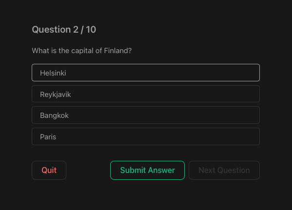

# vue-quiz-app



This is a sample quiz application built using [Vue 3](https://vuejs.org/guide/introduction.html) in [Vite](https://vitejs.dev/guide/). It mainly uses `Composition API` to implement `route views` and `components`.
Trivia questions are now generated using [Open Trivia DB API](https://opentdb.com/api_config.php)(OpenTDB).

# Objective

This is purely a coding exercise meant to refresh my knowledge of `Vue`.

From the last time I tried `Vue`, there seems to be significant changes in how things are done that [made some developers upset](https://www.reddit.com/r/vuejs/comments/pmpmot/rant_how_vue_3_drove_me_away/).

Browsing through [my old Vue projects from 2 years ago](https://github.com/supershaneski?tab=repositories&q=vue&type=&language=&sort=), there are many things that I already forgot so that means I can start using `Vue 3` without any apprehension.


# Development

I will be using the following modules:

* [Pinia 2](https://pinia.vuejs.org/introduction.html), for global app state management
* [Vue Router 4](https://router.vuejs.org/installation.html), for router

At this point, I have not made my mind yet on how to best implement a quiz app.
Perhaps a simple SPA would suffice and there is no need for a router.
But since this is more of a refresher for `Vue`, using as many standard modules is probably better for practice.

I mainly reused the generated code, files and styling from the build setup using `Vite` such that my `Pinia` store is still named as `counter.js`.


## The App

I am now fetching the quiz data from [Open Trivia DB API](https://opentdb.com/api_config.php).
It is completely free and does not require API key.

You can adjust the number of questions shown by editing the API call's `amount` parameter.

```javascript
const response = await fetch("https://opentdb.com/api.php?amount=10&type=multiple")
```

See function `getRemoteData()` from `./lib/utils.js`.

If you want to prepare your own questions, edit `/assets/questions.json` for the quiz data and set the variable `VITE_APP_USE_LOCALDATA` from the `.env` file to `true`.
However, please note that if you do so, questions are `shuffled` once a day.


## Options API vs Composition API

It is not difficult to convert one to the other. 
It also seems that I can combine both (is it?).
The main problem I encounter trying to convert my code to `Composition API` is that I need to scour the internet outside the documentation itself in order to fully implement `Composition API` for components and router.


# Setup

Clone the repository and install the dependencies

```sh
$ git clone https://github.com/supershaneski/vue-quiz-app.git myproject

$ cd myproject

$ npm install

$ npm start
```

Open your browser to `http://localhost:5173/` to load the application page.


# Additional Information

## Customize configuration

See [Vite Configuration Reference](https://vitejs.dev/config/).

### Compile and Minify for Production

```sh
npm run build
```

### Lint with [ESLint](https://eslint.org/)

```sh
npm run lint
```
